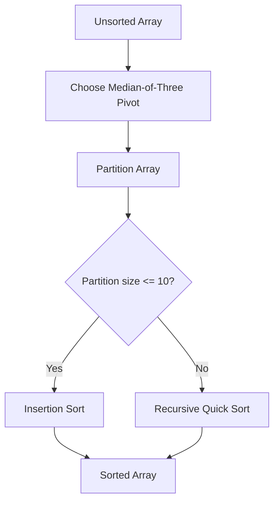

# ⚡ Modified Quick Sort

An optimized-practice implementation of **Quick Sort in C++** combining median-of-three pivot selection with insertion sort for small partitions.

## 🖼️ Sorting Strategy



## ✨ Approach

1. **Median-of-three pivot selection** uses the first, middle, and last elements to choose a pivot more intelligently than always choosing one fixed position.
2. **Insertion sort for small partitions** avoids recursive overhead when a partition has at most 10 elements.

## ⏱️ Complexity

- Average Quick Sort: **O(n log n)**
- Worst case: **O(n²)**
- Extra stack space depends on recursion depth.

## 🧰 Technology


## 🚀 Run

```bash
g++ main.cpp -o quicksort
./quicksort
```

The included example sorts an integer array and prints the result.

## 📌 Status

Completed algorithm-learning project.

## 👨‍💻 Author

**Dreamjain** — [GitHub](https://github.com/Dreamjain)
